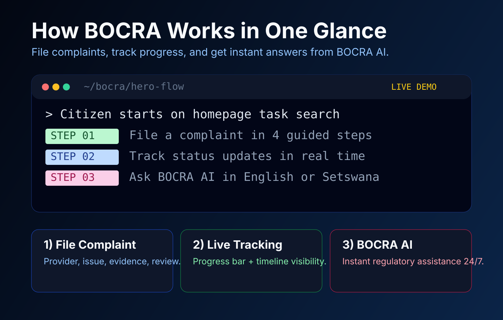
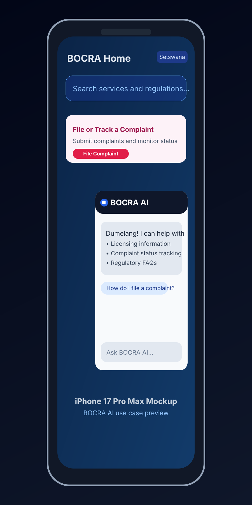
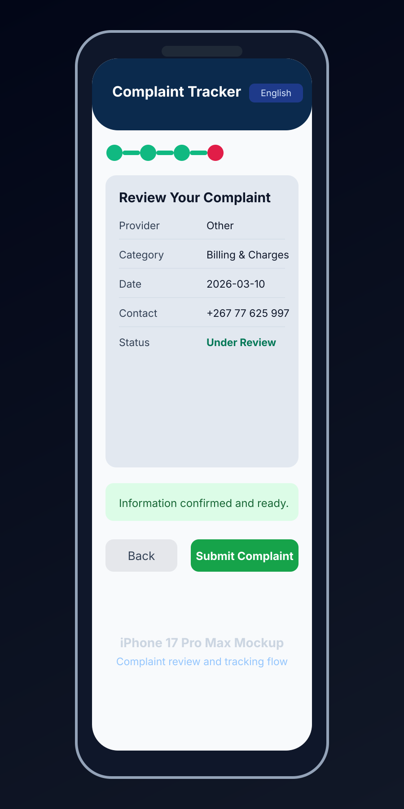
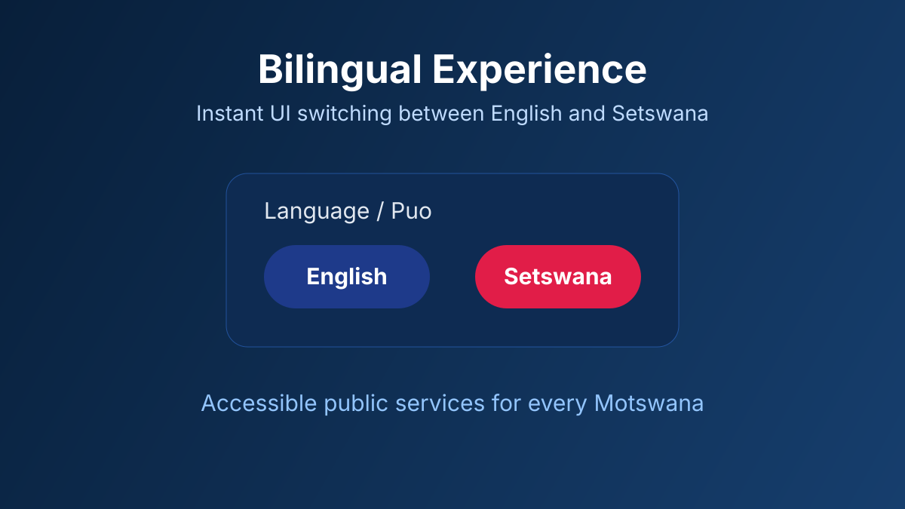

# 🚀 LIVE DEMO: https://bocra-web.vercel.app

<div align="center">

# 🔵🟢🔴🟡 BOCRA Digital Platform

**A modern, citizen-centric regulatory platform for Botswana**

[](https://nextjs.org/)
[](https://supabase.com/)
[](https://typescriptlang.org/)
[](https://vercel.com/)

### 👉 [Open the Live Platform](https://bocra-web.vercel.app)

</div>

---

## Hero Demo: Website Functionality at a Glance



### What users can do immediately
- **File a complaint** with a guided 4-step flow (Provider → Issue Details → Evidence → Review).
- **Track complaint progress live** with a clear stepper and timeline-style status visibility.
- **Chat with BOCRA AI** for instant help in **English or Setswana**.

---

## Visual Highlights

> All visuals below are presented in an **iPhone 17 Pro Max-style mockup** to better reflect real mobile usage.

### BOCRA AI Chatbot


### Complaint Tracker (Mobile View)


### English / Setswana Toggle


> These visuals are polished README showcase graphics (so your project still looks great even before final production screenshots/GIF captures).

## The Problem

BOCRA's current website is outdated — a COVID-19 banner still dominates the homepage in 2026, the search overlay blocks content on every page, navigation is flat and chaotic, there's no mobile responsiveness, and citizens have no transparent way to file or track complaints. Service delivery is fragmented, manual, and opaque.

## Our Solution

A complete reimagining of BOCRA's digital presence as a **task-first, citizen-centric platform** that puts services front and center, makes complaints trackable in real time, and introduces AI-powered assistance for regulatory queries.

## Key Features

**Complaints System** — Guided 4-step filing flow with Uber-style live tracking. Every action logged, every status visible. No more "we'll get back to you."

**BOCRA AI** — AI-powered chatbot that answers regulatory questions about licensing, complaints, type approval, and more. Speaks English and Setswana.

**Bilingual Support** — Full English / Setswana toggle across the platform. Because regulation should be accessible in your mother tongue.

**What We Regulate** — Clear sector breakdown: Telecommunications, Broadcasting, Postal Services, Internet & ICT — each with its own visual identity.

**Cybersecurity Advisories** — Real-time security alerts with severity badges. A new feature the current site completely lacks.

**Admin Dashboard** — Internal staff view with complaint processing queues and analytics (behind auth).

## What Makes This Different

| Current BOCRA Site | Our Platform |
|---|---|
| COVID-19 banner in 2026 | Task-oriented hero: "What do you need help with?" |
| Floating search overlay blocks content | Integrated search bar in hero + header |
| No complaint tracking | Uber-style live tracking with timeline |
| No mobile support | Mobile-first responsive design |
| English only | English + Setswana |
| No AI assistance | BOCRA AI chatbot |
| Flat navigation dump | Service cards with clear hierarchy |
| No cybersecurity info | Live advisories with severity levels |

## Tech Stack & Architecture

```
Frontend:   Next.js 14 (App Router) + TypeScript + Tailwind CSS
Backend:    Supabase (PostgreSQL + Row Level Security + Realtime)
AI:         BOCRA AI chatbot (Gemini API)
Auth:       Supabase Auth (citizen, operator, admin roles)
Deployment: Vercel (edge network, automatic HTTPS)
```

### Project Structure

```
bocra-web/
├── app/
│   ├── page.tsx                    # Homepage
│   ├── complaints/
│   │   ├── page.tsx                # File + Track landing
│   │   ├── new/page.tsx            # Multi-step complaint form
│   │   └── track/[id]/page.tsx     # Live timeline tracker
│   ├── licensing/page.tsx          # Licensing portal
│   ├── admin/dashboard/page.tsx    # Staff dashboard (auth-protected)
│   └── api/
│       ├── complaints/route.ts     # REST API endpoints
│       └── ai/route.ts             # BOCRA AI endpoint
├── components/
│   ├── layout/     # Header, Footer
│   ├── home/       # Hero, ComplaintStar, ServiceCards, SectorGrid,
│   │               # StatsBar, NewsGrid, DocsAndAlerts, CTABanner
│   ├── complaints/ # ComplaintsLanding, ComplaintForm, ComplaintTracker
│   ├── ai/         # BocraAI chatbot
│   ├── icons/      # 23 custom SVG icon components
│   └── ui/         # AnimatedNumber, shared utilities
├── lib/
│   ├── supabase.ts # Database client
│   └── types.ts    # TypeScript interfaces
└── tailwind.config.ts  # BOCRA brand tokens
```

## Security & Data Protection

- **Supabase Row Level Security** — Users can only access their own complaints
- **HTTPS enforced** via Vercel deployment
- **Input validation** on all form fields (client + server)
- **Security headers** — X-Frame-Options, CSP, HSTS
- **No sensitive data** stored in client-side state
- **Auth-protected admin routes** via middleware

## Scalability & Integration

- **REST API** at `/api/complaints` — ready for third-party integration
- **Supabase Realtime** — live complaint status updates without polling
- **Modular component architecture** — each feature is independently deployable
- **TypeScript throughout** — type-safe interfaces for all data models
- **Edge deployment** on Vercel — global CDN, auto-scaling

## Getting Started

```bash
git clone https://github.com/YOUR_REPO/bocra-web.git
cd bocra-web
npm install
cp .env.local.example .env.local
# Add your Supabase credentials to .env.local
npm run dev
```

Open [http://localhost:3000](http://localhost:3000).

## Team

**BOCRA Hackathon 2026 — Youth Category**

---

<div align="center">

*Built for the BOCRA Website Development Hackathon 2026*

**Regulating for a Connected Botswana**

</div>
